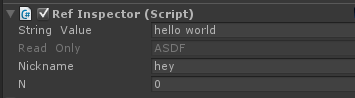
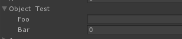
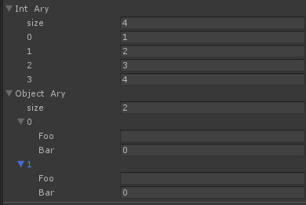

RefInspector.unity
====

`MonoBehaviour`가 아닌 오브젝트에 대해서 자동으로 에디터를 만들어줍니다.

Usage
----
```c#
public TestObj a = new TestObj();

void OnInspectorGUI()
{
  a.Inspector();
}
```

Samples
----
오브젝트의 프로퍼티들은 자동으로 타입에 맞는 에디터가 표시됩니다.
```c#
public class Test
{
  public string stringValue { get; set; }
  public String readOnly {
    get
    {
      return "ASDF";
    }
  }
  public String nickname { get; set; }
  public int n { get; set; }
}
```
<br>
<br>
프로퍼티를 정의하는 타입이 오브젝트일 경우, 해당 오브젝트에 대한 에디터가 표시됩니다.
```c#
public class Hello
{
  public string foo { get; set; }
  public int bar { get; set; }
}
public class Test
{
  public Hello objectTest { get; set; }

  public Test()
  {
    objectTest = new Hello();
  }
}
```
<br>
<br>
List 타입은 List 에디터가 표시됩니다. 이 List 에디터는 커스텀 클래스에 대한 리스트 에디터를 지원하지 않는 Unity 4 버전에서도 동작합니다.
```c#
public class Test
{
  public List<int> intAry { get; set; }
  public List<Hello> objectAry { get; set; }

  public Test()
  {
    intAry = new List<int>() { 1, 2, 3, 4 };
    objectAry = new List<Hello>()
    {
      new Hello(),new Hello()
    };
  }
}
```
<br>
